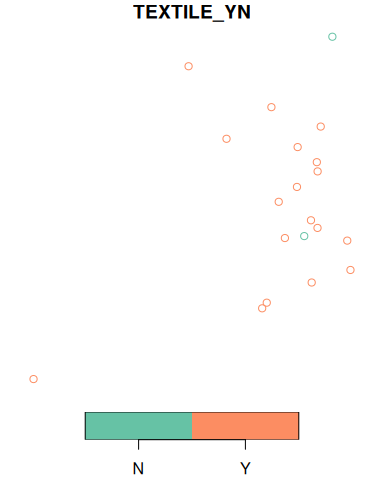

<!-- README.md is generated from README.Rmd. Please edit that file -->

# opendatascotland


<!-- badges: start -->

[](https://github.com/fozy81/opendatascot/actions/workflows/R-CMD-check.yaml)
[](https://lifecycle.r-lib.org/articles/stages.html#experimental)
[](https://app.codecov.io/gh/fozy81/opendatascot?branch=master)
<!-- badges: end -->

`opendatascotland` is an [R](https://www.r-project.org/) package to
download and locally cache data from the amazing
[opendata.scot](https://opendata.scot/) website. This helps to quickly
start data analysis by providing a simple way to save, organise and
import data in R.

## Installation

You can install the development version of `opendatascotland` from
[GitHub](https://github.com/) with:

``` r
# install.packages("devtools")
devtools::install_github("fozy81/opendatascot")
```

## Search

Search all available datasets by using the `ods_search()` function.
Additionally, use the `search` argument to query datasets by title.

``` r
library(opendatascotland)
# View all available datasets and associated metadata
all_datasets <- ods_search()
#> The cached list of datasets from opendata.scot was last downloaded on 2023-10-09

# Search dataset titles containing matching terms (case insensitive)
single_query <- ods_search("Number of bikes")
#> The cached list of datasets from opendata.scot was last downloaded on 2023-10-09

# Search multiple terms
multi_query <- ods_search(c("Bins", "Number of bikes"))
#> The cached list of datasets from opendata.scot was last downloaded on 2023-10-09
head(multi_query, 3)
#> # A tibble: 3 × 11
#>   unique_id            title organization notes category url   resources licence
#>   <chr>                <chr> <chr>        <chr> <list>   <chr> <list>    <chr>  
#> 1 Litter_Bins_Aberdee… Litt… Aberdeen Ci… <div… <chr>    /dat… <df>      UK Ope…
#> 2 Communal_Bins_City_… Comm… City of Edi… <p><… <chr>    /dat… <df>      UK Ope…
#> 3 Grit_Bins_City_of_E… Grit… City of Edi… <p><… <chr>    /dat… <df>      UK Ope…
#> # ℹ 3 more variables: date_created <chr>, date_updated <chr>, org_type <chr>
```

Note, search term is case-insensitive but word order must be correct
(there is no ‘fuzzy’ matching).

## Download

Currently, only datasets available in `.csv`, `.json` or `.geojson` can
be downloaded. These formats cover the majority of data available. You
will be warned if data can’t be downloaded.

To download data, you can either download the metadata using
`ods_search()`, then pass that data frame to `ods_get()`

``` r
query <- ods_search("Public Litter Bins")
data <- ods_get(query)
```

Or use the search argument in `ods_get(search = "my search term")` to
search and download matching datasets in one step.

``` r
data <- ods_get(search = "Salt Bins")
```

By default, you will be asked if you want to save the data locally on
the first download. Optionally, you can refresh the data or avoid being
asked to save data.

``` r
data <- ods_get(search = "Number of bikes", refresh = TRUE, ask = FALSE)
```

The `ods_get()` function returns a named list of data frames

``` r
data <- ods_get(search = c("Salt Bins", "Recycling Points"))
names(data)
[1] "Glass_and_textiles_recycling_points_Aberdeenshire_Council"
[2] "Recycling_Points_Aberdeen_City_Council"                   
[3] "Recycling_Points_Moray_Council"                           
[4] "Salt_Bins_Dumfries_and_Galloway_Council" 
```

Select the dataset by name.

``` r
recycling_points <- data$Recycling_Points_Aberdeen_City_Council
```

Or alternatively select data frame in the list by position number.

``` r
recycling_points <- data[[2]]
```

Geojson datasets are automating converted to [simple
feature](https://r-spatial.github.io/sf/) ‘sf’ data. This helps make
geospatial data easier to handle in R. As we can see in this example the
data frame is classed as “sf” which means spatial / geometry coordinates
are held in a `geometry` column.

``` r
class(recycling_points)
#> [1] "sf"         "data.frame"
```

This allows the `plot()` function to automatically plot the coordinates
in the geometry column.

``` r
plot(recycling_points[, "TEXTILE_YN"])
```


